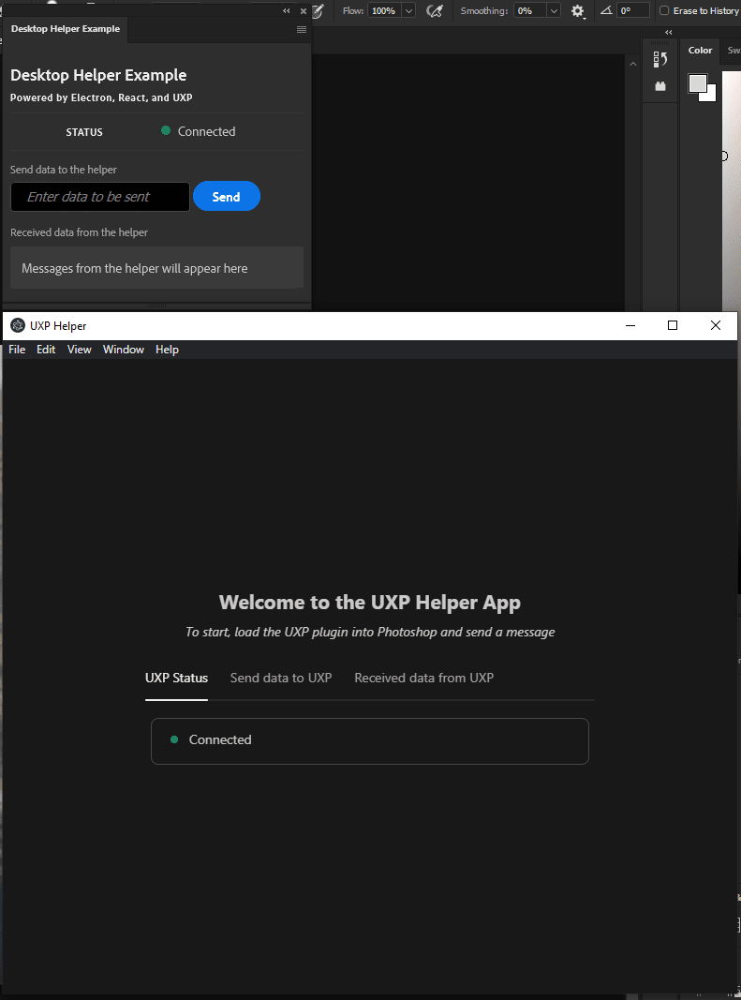

# Desktop Helper Example

This sample has two components, a UXP plugin and an Electron application built in React.

For developers who have used `create-react-app` before, the folder structure and tools used in the Electron application will be familiar.

Both components must be running for the example to work correctly.

# Configuration

The following steps will help you load the plugin into Photoshop and get the Electron app up and running.

## UXP Plugin

### 1. Install Node.js dependencies

```
$ cd uxp
$ yarn install   # or npm install
```

### 2. Run plugin in watch or build mode

```
$ cd uxp
$ yarn watch     # or npm run watch

# OR

$ yarn build     # or npm run build
```

- `yarn watch` or `npm run watch` will build a development version of the plugin, and recompile everytime you make a change to the source files. The result is placed in `uxp/dist`.
- `yarn build` or `npm run build` will build a production version of the plugin and place it in `uxp/dist`. It will not update every time you make a change to the source files.

> You **must** run either `watch` or `build` prior to trying to use within Photoshop!

## Electron Helper

### 1. Install Node.js dependencies

```
$ cd helper
$ yarn install   # or npm install
```

### 2. Run helper app

```
$ cd helper
$ yarn start
```

### 3. (Optional) Build the helper app

```
$ cd helper
$ yarn build
```

**Warning:** This command will take quite some time to execute.

In Electron, production builds compile JavaScript into a binary executable on the target platform for distribution or personal use. It is recommended that you build for production when you finish development.

Once built, navigate to the `helper/dist` folder and double click the `UXP Helper App Setup 1.0.0` installer. Upon installation, the helper app can be run locally. Please note, the Electron project will have to be rebuilt and reinstalled for any future changes to take effect in production.

# Load the Plugin

You can use the UXP Developer Tools to load the plugin into Photoshop.

If the plugin hasn't already been added to your workspace in the UXP Developer Tools, you can add it by clicking "Add Plugin..." and selecting `uxp/dist/manifest.json`. **DO NOT** select the `manifest.json` file inside the `uxp/plugin` folder.

Once added, you can load it into Photoshop by clicking the ••• button on the corresponding row, and clicking "Load". Switch to Photoshop and you should see the sample panel.

# Using the Plugin

This plugin uses an embedded websocket server to communicate between the Electron helper app and UXP.

Files for the server and electron configuration are located in the `helper/public` folder and are served as entrypoints for Electron on build.

Once both components are launched, you should be greeted with `'Connected'` status' on both components. If one component disconnects, the other will automatically recognize this disconnect as well, and the changes should be reflected with a `'Disconnected'` status.



Since it's an embedded server, its worth noting that this only runs on `localhost` and only administers communication between a single instance of the helper app and the UXP plugin. By default, the websocket server runs on port `4040` and the Electron helper app is served from port `3000`.

Other than connecting with one another, the two components can also pass strings of text which get reflected in their `Received data from the helper` and `Received data from UXP` sections.

## Note On socket.io

Currently, this sample uses `127.0.0.1` to connect to the socket server in order to work on all platforms.

For Windows users, this can be changed to `localhost` with no errors.

However, for Mac users, the socket connection must be changed (in both `uxp/src/index.js` and `helper/src/components/SocketContext.jsx`) to bypass the client 'polling' phase:

```
let socket = io('http://localhost:4040', { transports: ['websocket'] });
```

In order for UXP to establish a connection to the socket server through `localhost`.
