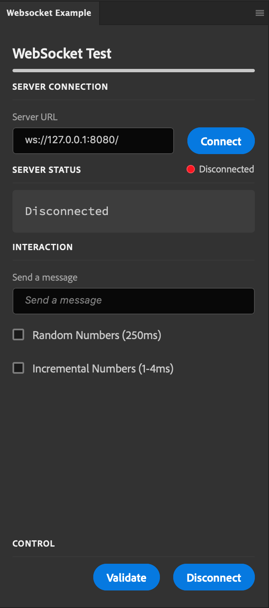
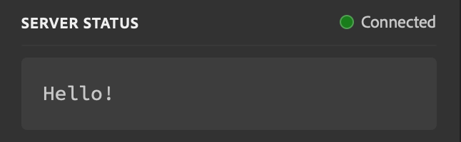

# Websocket Example

This repository includes two components -- a Ps plugin and a Node Websocket server. You need both running for the example to work correctly.

## Install Node Dependencies

```
cd server
npm install
```

## Start the Node Websocket Server

```
cd server
npm run start
```

You should see something like the following on the terminal:

```
Wed Sep 09 2020 17:23:04 GMT-0400 (Eastern Daylight Time) Hi!
Wed Sep 09 2020 17:23:04 GMT-0400 (Eastern Daylight Time) Server is listening on port 8080
```

> Note: if you have something else running on port 8080, you'll need to modify `server/index.js` and change the port number manually.

## Load the plugin

The plugin requires no dependencies and can be run by using the UXP Developer Tools. Click "Add Plugin..." in the UXP Developer Tools and select `plugin/manifest.json`, then click the ••• button and select "Load...". 

## Using the plugin

The plugin demonstrates communication between the panel and the server. It doesn't do anything useful with the Photoshop document.



### Server Connection

This defaults to using `127.0.0.1:8080`, which is what the server should also be running on. If you changed the server's port, be sure to change it here as well.

To connect to the server, click the `Connect` button. If all goes well, you should see a "Hello!" message.



### Server Status

The server status indicates if you're connected or not, and includes the text of the last received message from the server.

### Interaction

You can interact with the server a few different ways.

* You can send a message to the server. This is just a text string, but the server understands only a specific format. See the protocol section below.
* If you check "Random Numbers (250ms)", the server will send a new random number to the plugin every quarter second. This will be displayed in the Server Status section.
* If you check "Incremental Numbers (1-4ms)", the server will send a new, incrementing number to the plugin on a rapid basis.

### Control

You can check to see if the server and plugin agree on the messages that were sent and received by clicking "Validate". If all is good, you'll see "received everything ok" in the Server Status. If some messages have been missed, you'll see "missed messages" in the Server Status, and the server will dump the two states to the console for you to compare.

You can also disconnect from the socket by clicking the "Disconnect" button.

## Protocol

The protocol is text-based and very simple. The plugin and server communicate using the following messages:

* Sent from the server to the plugin:
    * `text=string-to-display`: tells the plugin to display the following text.
    * `err=error-to-display`: tells the plugin to show an error from the server.
* Sent from the plugin to the server:
    * `echo=string-to-echo`: Tells the server to send back the requested string using the `text` command.
    * `rand=on`: Tells the server to start sending random numbers every quarter second.
    * `rand=off`: Tells the server to stop sending random numbers.
    * `fast=on`: Tells the server to quickly send incrementing numbers.
    * `fast=off`: Tells the server to stop sending incrementing numbers.
    * `validate=received-messages`: Tells the server to compare what it sent to us against `received-messages`. If they match, `text=received everything ok` is returned. If not, `text=missed messages` is returned, and the server dumps what it sent and what the plugin thinks it received so you can compare the difference.

Anything else will result in an error message being generated.