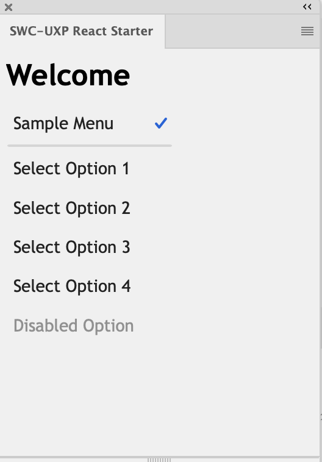
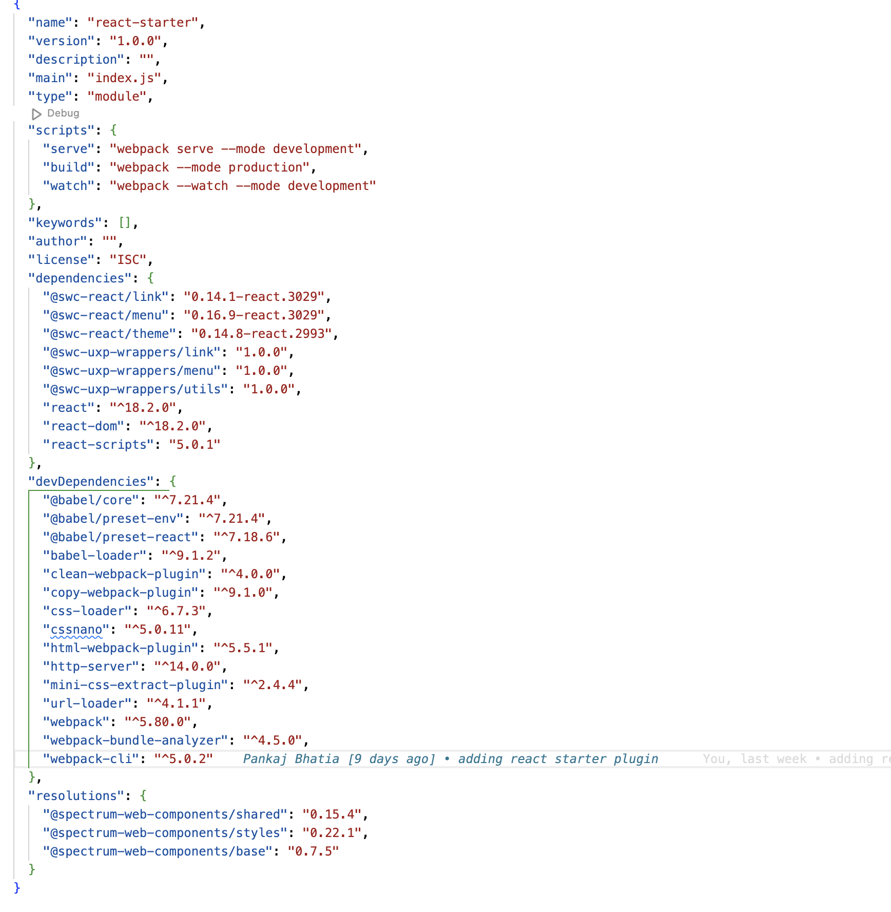

# UXP Plugin with Spectrum Web Component in React context

This starter will help you to create a **React** based UXP plugin using Spectrum Web Component (SWC). It includes setting up the project, integrating the SWC components, and mounting it over the host application - Photoshop.

## Documentation
- [SWC in UXP](https://developer.adobe.com/photoshop/uxp/2022/uxp-api/reference-spectrum/swc)
- [Adobe's list of SWC](https://opensource.adobe.com/spectrum-web-components/index.html)

## Getting started

**Pre-requisites**
1. [NodeJS](https://nodejs.org/en) (>= v 16.0.0)
2. [Yarn package manager](https://yarnpkg.com/getting-started/install)
3. UXP Developer Tool (UDT)
4. UXP >= 7.2

**Build and run**
1. Start by installing the dependencies `yarn install`.
2. Prepare the bundle using Webpack `yarn build`. You will notice a **dist** folder after this step.
3. (Optional) `yarn watch` to automatically build the project every time you update a source file and `yarn start` to keep the plugin running and automatically build after every change.

**Load the plugin into the application via UDT**
1. Make sure the application is running and you can see it under 'Connected apps'.
2. Click on 'Add Plugin' button and select the `manifest.json` of this plugin.
3. Configure the `dist` folder of your plugin by using 'More' -> 'Advanced' option from the action menu `•••`
4. Click on the ••• menu on the corresponding plugin row. Select 'Load' to view the plugin inside your application.
5. (Optional) Select 'Watch' from plugin actions ••• to dynamically load the latest plugin changes. Note that a manifest change would need you to 'Unload' and 'Load' the plugin from scratch.


<br></br>

You should be able to see a banner in Photoshop plugin.



## Add a new component
You can use any of the supported components listed in [our docs](https://developer.adobe.com/photoshop/uxp/2022/uxp-api/reference-spectrum/swc) by following these steps:

1. Use `yarn add` to install the components and its supported version.

```javascript
yarn add @swc-uxp-wrappers/link;
yarn add @swc-react/link@0.14.1-react.3029;
```

**Note:** The UXP-SWC components are delivered via wrappers over specific SWC versions. For example, `@swc-uxp-wrappers/menu` is locked and wrapped on  **0.16.9** version of ```@spectrum-web-components/menu```. Thereby for React framework we will need to use ```@swc-react/menu:0.16.9-react.3029``` which is the react-wrapper closest to the SWC component version (0.16.9) in dependency block too. Also, please note that components like `icons`,`icons-workflow`, `icons-ui`, `theme`, `shared` , `base`,`styles` do not use wrappers and therefore must be directly consumed from `@spectrum-web-components` library npm.




2. Register the component in `App.js` file.

```javascript
import { Link } from "@swc-react/link";
```

3. Add the component in the same file.

```html
   This is a <Link href="#">example link</Link>.
```

4. We need to add alias configuration in the webpack config file. This project contains the configuration already. Notice the `@swc-uxp-wrappers/utils` entry in the package.json. This package delivers the `alias.js` file for all the supported components which is then imported in the `webpack.config.js` file as this.
```
import { aliases } from '@swc-uxp-wrappers/utils';
```

5. Run `yarn build` to prepare the distribution bundle.
You can also use `yarn watch` to create the bundle as soon as you save your changes to any source files. Use this along with Plugin -> Watch option in UDT to sync with latest changes automatically.

## Deep dive
Now that the plugin is working, let's look into the details.
### webpack.config.js

Webpack is used to bundle the dependencies in the project therefore you would see the webpack.config.js file for basic config.

Notice the installed `@swc-uxp-wrappers/utils` package in the package.json file. It is being used it to provide [aliasing](https://webpack.js.org/configuration/resolve/#resolvealias) via mapping. You can remove this aliasing and use the same plugin on web too.

```
       resolve: {
            extensions: ['.js', '.json'],
            alias: aliases,
        }
```

Pro tip: For debugging purposes, add `eval-cheap-source-map` in the webpack.config file to get the source map in UDT debug window.

```javascript
devtool: 'eval-cheap-source-map'
```


### .babelrc

This is config file for `babel` library to transpile the code, especially the JSX syntax, to match the environment's capabilities.


### package.json

Once you install the component (using `yarn add`) you should see the components added to the 'dependencies'.


### manifest.json
Enable SWC by setting the **enableSWCSupport** flag to true.

```
"featureFlags": {
   "enableSWCSupport": true
}
```

### src/index.js

This is the entry point of the project.

Ensure that the the components are wrapped with a `Theme` component. It ensures that the Spectrum design tokens are delivered to the scoped HTML context.
```
const root = ReactDOM.createRoot(document.getElementById("root"));
root.render(
  <React.StrictMode>
    <Theme theme="spectrum" scale="medium" color="light">
      <App />
    </Theme>
  </React.StrictMode>
);

```

### **src/index.html**

Entry point of the HTML structure of React app index.js.

### **src/App.js**
The main React component. This component serves as the root of your component tree. You may also wrap your component with `Theme` here.
```
function App() {
  return (
    <div>
      <h1>Welcome</h1>
    <Theme theme="spectrum" scale="medium" color="light">
        <Menu selects="single">
          <MenuItem selected>Sample Menu</MenuItem>
          <MenuDivider></MenuDivider>
          <MenuItem>Select Option 1</MenuItem>
          <MenuItem>Select Option 2</MenuItem>
          <MenuItem>Select Option 3</MenuItem>
          <MenuItem>Select Option 4</MenuItem>
          <MenuItem disabled>Disabled Option</MenuItem>
        </Menu>
        </Theme>
        <br />
        This is an <Link href="#">example link</Link>.
    </div>
  );
}

```


## Recommended `@swc-react` library  versions can be referred in the [developer documentation](https://developer.adobe.com/photoshop/uxp/2022/uxp-api/reference-spectrum/swc)


