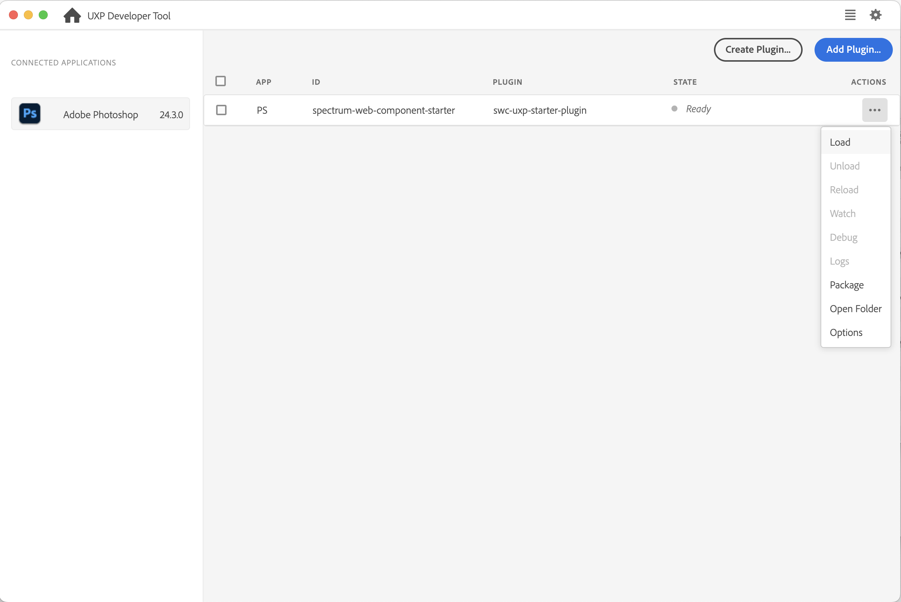
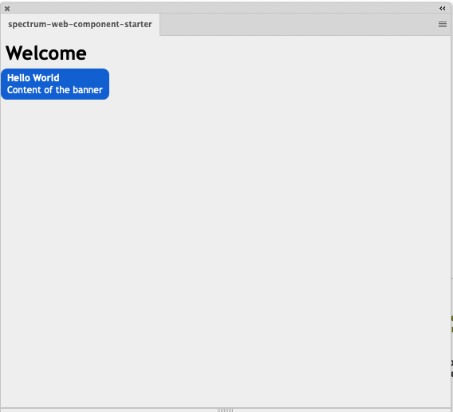
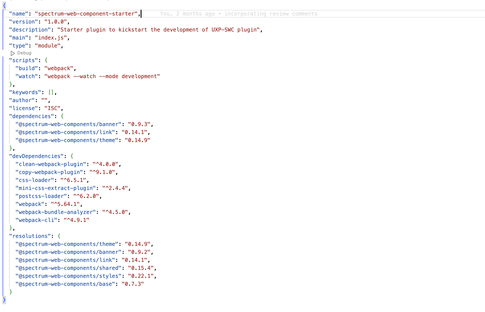

# UXP Plugin with Spectrum Web Component

This starter will help you to create a Spectrum Web Component (SWC) based UXP plugin. It includes setting up the project, integrating the SWC components, and mounting it over the host applications - Photoshop.

## Documentation
- [SWC in UXP](https://developer.adobe.com/photoshop/uxp/2022/uxp-api/reference-spectrum/swc)
- [Adobe's list of SWC](https://opensource.adobe.com/spectrum-web-components/index.html)


## Getting started

**Pre-requisites**
1. [NodeJS](https://nodejs.org/en) (>= v 14.20.0)
2. [Yarn package manager](https://yarnpkg.com/getting-started/install)
3. UXP Developer Tool (UDT)

**Build and run**
1. Start by installing the dependencies `yarn install`.
2. Prepare the bundle using Webpack `yarn build`. You will notice a **dist** folder after this step.
3. (Optional) `yarn watch` to automatically build the project every time you update a source file and `yarn start` to keep the plugin running and automatically build after every change.

**Load the plugin into the application via UDT**
1. Make sure the application is running and you can see it under 'Connected apps'.
2. Click on 'Add Plugin' button and select the `manifest.json` of this plugin.
3. Configure the `dist` folder of your plugin by using 'More' -> 'Advanced' option from the action menu `•••`
4. Click on the ••• menu on the corresponding plugin row. Select 'Load' to view the plugin inside your application.
5. (Optional) Select 'Watch' from plugin actions ••• to dynamically load the latest plugin changes. Note that a manifest change would need you to 'Unload' and 'Load' the plugin from scratch.




You should be able to see a banner in Photoshop plugin.





## Add a new component
You can use any of the supported components listed in [our docs](https://developer.adobe.com/photoshop/uxp/2022/uxp-api/reference-spectrum/swc) by following these steps:
1. Use `yarn add` to install the components and its supported version.

```javascript
yarn add @swc-uxp-wrappers/link@1.0.0;
```

**Note:** The UXP-SWC components are delivered via wrappers over specific SWC versions. For example, `@swc-uxp-wrappers/banner` is locked and wrapped on  **0.9.2** version of ```@spectrum-web-components/banner```. Make sure to install the latest `swc-uxp-wrappers` and add the recommended SWC component version (example 0.9.2) in resolutions block too. Also, components like `icons`, `icons-workflow`, `icons-ui`, `theme`, `shared`, `base`, `styles` do not use wrappers and therefore must be directly consumed from npm.





2. Import the component in `index.js` file. This has two approaches:

   a. Import directy via `@swc-uxp-wrappers`
   ```javascript
   import "@swc-uxp-wrappers/link/sp-link.js";
   ```
   b. Import via `@spectrum-web-components` and use aliasing in the webpack.conf.js file.
   ```javascript
   import '@spectrum-web-components/link/sp-link.js';
   ```
   We are using aliasing to map these components (`@swc-uxp-wrappers` to `@spectrum-web-components` in webpack.conf.js as described in Deep Dive section). This approach makes the plugin cross-platform compatible i.e we can remove the aliasing and use the same plugin on Web.

3. Add the component in the html file.

   ```html
   This is an <sp-link href="#">example link</sp-link>.
   ```

4. Run `yarn build` to prepare the distribution bundle.
You can also use `yarn watch` to create the bundle as soon as you save your changes to any source files. Use this along with Plugin -> Watch option in UDT to sync with latest changes automatically.

## Deep dive
Now that the plugin is working, we can look into the details.

### webpack.config.js
Webpack is used to bundle the dependencies in the project therefore you would see the webpack.config.js file for basic config.

Note that we have installed the `@swc-uxp-wrappers/utils` package in the package.json file and are using it to provide [aliasing](https://webpack.js.org/configuration/resolve/#resolvealias) via mapping. We can remove this aliasing and use the same plugin on web too.

```
       resolve: {
            extensions: ['.js', '.json'],
            alias: aliases,

        }
```

Pro tip: For debugging purposes, add `eval-cheap-source-map` in the webpack.config file to get the source map in UDT debug window.

```javascript
devtool: 'eval-cheap-source-map'
```

### package.json
Once you install the component (using `yarn add`) you should see the components added to the 'dependencies'.

Also, in order to resolve transitive dependencies we need to [force resolutions](https://classic.yarnpkg.com/lang/en/docs/selective-version-resolutions/). Thereby to avoid incompatibility issues in sub components, one needs to mention all the dependencies in the `resolutions` block too.

### manifest.json
Enable SWC by setting the **enableSWCSupport flag** to true.

```
"featureFlags": {
   "enableSWCSupport": true
}
```

### src/index.html
Includes index.js.

Observe that the SWC components are wrapped with a ```<sp-theme>``` element. This ensures that the Spectrum design tokens are delivered to the scoped HTML context.


### src/index.js
Import the components and themes to deliver the right styling to the components.
```javascript
//sp-theme
import '@spectrum-web-components/theme/sp-theme.js';
//themes to use classic and spectrum themes
import '@spectrum-web-components/theme/src/themes.js';
import '@spectrum-web-components/theme/src/express/themes.js';
```


## Troubleshooting

 If you see the following error in the console, these are some steps to resolve it.

```
Failed to execute 'define' on 'CustomElementRegistry': the name "sp-icon-alert" has already been used with this registry
```

Such errors occur when the package manager has resolved more than one copy of the component (sp-icon-alert in this case). Some of the ways to troubleshoot are:

* Make sure you dont have multiple calls to `index.js` somehow.
* Check if you have added the component in the resolutions block in package.json.
* Check if you are using correct recommended version of the package without the `^`.

