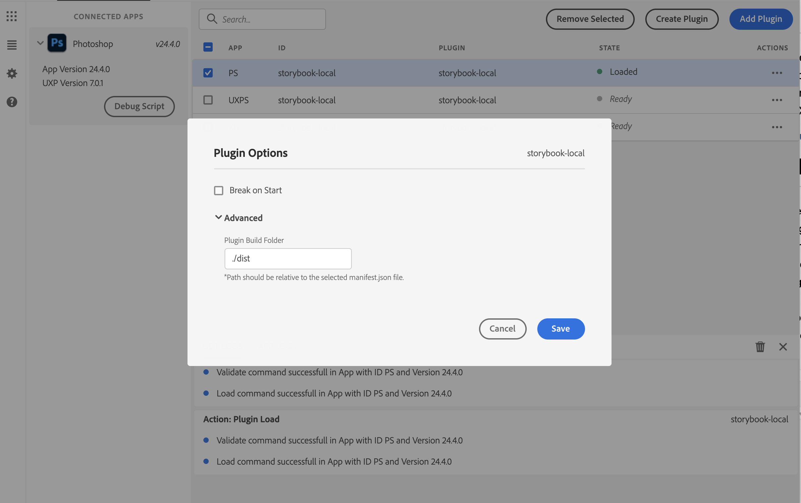

# **UXP Plugin with Spectrum Web Component**
Since UXP v7.0
# **Objective**
This sample will help you to create a Spectrum Web Component (SWC) based UXP plugin. It includes setting up the project, integrating the SWC components, and mounting it over the host applications - Photoshop and XD.

Start by learning about [Spectrum Web Components](https://opensource.adobe.com/spectrum-web-components/index.html)


# **Getting started**
1. Start by installing the dependencies `yarn install`
2. Prepare the bundle using Webpack `yarn build`. You will notice a **dist** folder after this step.
3. Add the plugin in UXP Developer Tool (UDT). Click on 'Add Plugin' in UDT and navigate to the `manifest.json` inside the dist folder.
4. Load the plugin in Photoshop/XD by launching the app. Click on the plugin action menu in UDT and select 'Load'.



<br></br>
You should be able to see a banner in Photoshop.


<br></br>

# **Deep dive**
Now that the plugin is working, we can look into the details.

### **webpack.config.js**

Webpack is used to bundle the dependencies in the project therefore you would see the webpack.config.js file for basic config.

Pro tip: For debugging purposes, add `eval-cheap-source-map` in the webpack.config file to get the source map in UDT debug window.

```javascript
devtool: 'eval-cheap-source-map'
```

### **package.json**

Components used in the project should be mentioned under the dependencies block here.

### **manifest.json**

Enable SWC by setting the **enableSWCSupport flag** to true.

```
"featureFlags": {
   "enableSWCSupport": true
}
```

### **debug.json**
Contains additionall (and optional) debug config for UDT. You can specify the port number and set the option to `breakOnStart`.

### **src/index.html**
Includes index.js.

Observe that the SWC components are wrapped with a ```<sp-theme>``` element. This ensures that the Spectrum design tokens are delivered to the scoped HTML context.

### **src/index.js**
Import the components and themes to deliver the right styling to the components.
```javascript
//sp-theme
import '@spectrum-web-components/theme/sp-theme.js';
//themes to use classic and spectrum themes
import '@spectrum-web-components/theme/src/themes.js';
import '@spectrum-web-components/theme/src/express/themes.js';
```
# **Add a new component**
You can use any of the supported components listed below by following these steps:
1. Use yarn add to install the components and its supported version.

```javascript
yarn add @spectrum-web-components/link@0.14.1;
```

**Note:** Make sure to install the recommended version and add the same under the resolutions block in package.json too.


2. Import the component in *index.js* file.

```javascript
import '@spectrum-web-components/link/sp-link.js';
```

3. Add the component in the html file.

```html
This is an <sp-link href="#">example link</sp-link>.
```

4. Run `yarn build` or `yarn watch` to prepare the dist bundle.

# **4. Frequently Asked Questions**
1. Do I need to install specified versions of the components?

   Yes. It is recommended to use the specified versions. There could be inter dependancy of the components and one component could get impacted if the other upgrades. 

2. Do I need to wrap all the components in <sp-theme> ?

   Yes. `<sp-theme>` is the one which delivers the spectrum style tokens to the wrapped html.
   Also make sure to import the appropriate theme.

3. Why do I need the resolution block in the package.json?

   In order to resolve transitive dependancies we need to [force resolutions](https://classic.yarnpkg.com/lang/en/docs/selective-version-resolutions/). Thereby맚o avoid incompatibility issues in sub components, one needs to mention all the dependancies in the resolution block too.
4. I see the following error in the console. How do I resolve this ?

```
Failed to execute 'define' on 'CustomElementRegistry': the name "sp-icon-alert" has already been used with this registry
```

Such errors occur when the package manager has resolved more than one copy of the component (sp-icon-alert in this case. Some of the ways to troubleshoot are:

* Make sure you dont have multiple calls to bundle.js somehow.
* Check if you have added the component in the resolutions block in package.json.
* Check if you are using correct recommended version of the package without the `^`.


# **Supported Components**
Following are the components with their variants supported along with the versions.

**Note:** These components are in their Beta phase, and we are working on enhancing these features.

The text color of the variants represents the state they are in:

🟢 Works as per the specs of SWC(web) version.

🟠 Works as per the specs. However, there are minor styling issues.

🔴 Issues due to missing UXP core platform features. Will be addressed only in later releases.

| Components      | Variants with status | Version |  Workarounds (if any)
| --------------- | -------------------- | ------- |  ------------  |
| Action-Bar      |   Fixed 🟢    <br></br>   Sticky 🔴      |      0.5.9 |
| Action-Button   |  Standard 🟢   <br></br>  Selected 🟢  <br></br>   Disabled	 🟢 <br></br>  Quiet 🟢  <br></br>   Emphasized 🟢  <br></br>  Toggles 🔴  <br></br>   hold-affordance 🟢  | 0.8.7 |
| Action-group |   Standard 🟢  <br></br>  selects (single/multiple) 🔴  <br></br>  Selected  🟢 <br></br>  Vertical 🟢   | 0.12.4 |  ``` margin-right: 10px; ```
| Avatar |   Standard 🟢   | 0.10.3 |
| Banner |   Info 🟢  <br></br>  Error 🟢  <br></br>   Corner placement 🟢   | 0.9.2 |
| Button |   Accent 🟠  <br></br>   Primary 🟠  <br></br>  Secondary 🟠  <br></br>  Negative 🟠  <br></br>  Black 🟠  <br></br>  White 🟠  <br></br>  Content with label 🟢  <br></br>  Content with icon 🟢  <br></br>  Content with svg 🟠 <br></br> | 0.19.8 |   ``` document.querySelector("sp-button").style.color= 'black' ```
| Card |   Normal 🟢  <br></br>   Action 🔴  <br></br>  No preview Image 🟢  <br></br>  Quiet 🟢  <br></br>  Gallery 🟢  <br></br>  Horizontal 🟢  <br></br>  Linking 🟢  | 0.13.4 |
| Divider |   Horizontal 🟢  <br></br>   Vertical 🟢  <br></br> | 0.5.0 |
| Field-Label |   Standard 🟢  <br></br>  Start 🟢  <br></br>  End 🔴  <br></br> | 0.10.3 | ``` Padding-left can be applied to emulate the 'side-aligned'='end' behaviour ```
| icons-workflow |   Standard 🟢  <br></br> | 0.9.5 |
| Icons-ui |   Standard 🟢  <br></br> | 0.9.5 |
| Illustrated-message |    Standard 🟢  | 0.9.8 |
| Link |    Standard 🟢  <br></br>   Secondary 🟢  <br></br>  Static colored 🟢  <br></br>  Quiet 🟢  <br></br>| 0.14.1 |
| Menu |   Standard 🟢  <br></br>  With pop-over 🟢  <br></br>  Selects (Single/Multiple) 🔴  <br></br> | 0.16.9 |
| Menu-group |   Standard 🟢  <br></br> | 0.16.9 |
| Menu-item |   Standard 🟢  <br></br>  Icon-slot 🟢  <br></br>  Value-slot 🟢  <br></br>  Sub menu 🔴  <br></br> | 0.16.9 | Add styling to sp-icon to render selection for sp-menu-item ```padding-left:-8px```
| Popover |   No Tip 🟢  <br></br>  With Tip 🔴  <br></br>  Dialog Popover  🟢 <br></br> | 0.12.4 |


