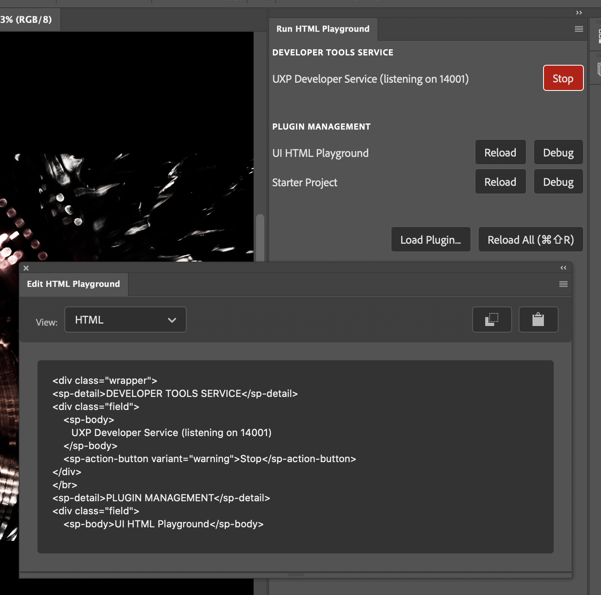

# Photoshop UXP Playground Plugin

This plugin is designed to make it simple to test out simple HTML layouts in Photoshop using UXP's layout engine. To use this, install the plugin (you can link to the Photoshop plugin directory) or load the plugin using File > Scripts > Load UXP Extension... or use the developer tools.

> **Note:**
>
> If you don't want to build the plugin, you can load the plugin directly from the `dist` folder. This is a prebuilt version.

## Usage

There are two panels supplied. The "Edit HTML Playground" panel allows editing HTML, and the "Run HTML Playground" enables you to see the results.

You can set your HTML, Styles, and JS code by switching the editor between those modes using the dropdown on the upper left of the panel. When in JavaScript mode, you can enable "auto-run" or just execute the snippet by clicking the "Play" button. If an error occurs, you'll see the error in below the editor.

> **Note**
>
> When running JavaScript, your code is executed inside a function that receives the preview panel's root node (named `rootNode`). You can use this to better restrict your JS code to just your preview panel.

You can copy the text in the editor to your clipboard, or paste your clipboard contents back into the editor by using the two buttons at the top right of the plugin. The "paste" button will **replace** the entire contents of the editor, so use with care.

The "Run HTML Playground" panel will show you a live preview of your HTML in a separate panel. You can have both the editor and preview visible at the same time in order to see your changes take effect as you type.

## About

This plugin uses React to render its UI, and also uses React Portals to manage multiple panels. For some tips, pay close attention to how the app uses a PanelController and responds to UXP events to properly mount the panel in the right location.

You don't _have_ to use portals to manage multiple panels, of course, but it proved an easier way to think of things in my mind.

This version also has an up-to-date manifest for UXP v4.0 (the previous version is renamed `manifest.v3.json` so you can look at the differences).

This version also shows how to handle `onChange` events with web components. React doesn't pass this event along for web components, meaning that Spectrum UXP components feel like they don't work. Instead, the trick is to attach the event listener directly. This is apparently a known issue with React that has yet to be fixed. See the `WC` component for a wrapper that might meet your needs.

